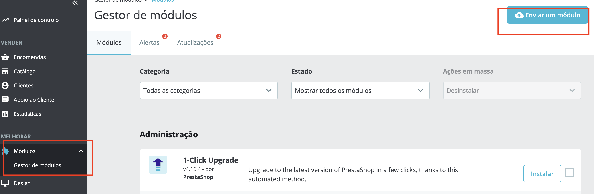

<div align="center">
  
</div>

<h1 align="center">
<br>
   Integrating Woovi with Prestashop
  
</h1>


<h4 align="center">
 Woovi module for Prestashop
</h4>
<p align="center">
  
  <a href="https://github.com/VictorG1002/woovi/commits/master">
    
  </a>
</p>


## 📚 Resume 

This document details steps necessary to connect your e-Commerce platform, based on Prestashop, to Woovi. The Woovi platform performs real-time reconciliation between your Bank and your e-Commerce. After connecting your Woovi account, you can charge customers in real time with Pix QrCodes.


## 🚀 How To Use

  If you don't already have the environment installed to run prestashop locally, click the link below

-  [How to use prestashop locally](https://help-center.prestashop.com/en/articles/10672892369170-install-prestashop-locally-on-your-computer)

  After running prestashop locally, clone the woovi module project and follow the next steps

```bash
# Clone this repository
$ git clone https://github.com/VictorG1002/woovi.git
```
After cloning the woovi module, go to the modules tab in the prestashop admin area and click on send module, then send the module compressed in zip format

 


##

Made with ♥ by Victor Oliveira ➡️ [Get in touch!](https://www.linkedin.com/in/victoroliveira-/)
